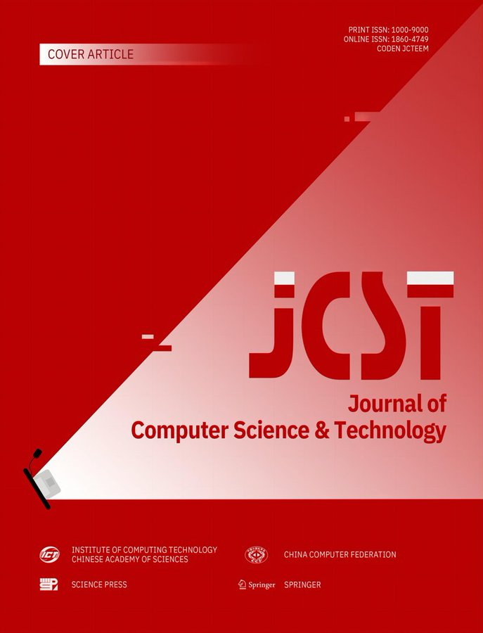

"An Overview of Cangjie Programming Language" is now published in the *Journal of Computer Science and Technology* (JCST), one of China's leading computer science journals indexed by SCI.

## What the research covers

- **Statically typed and compiled:** robust type inference powered by modern compiler frontend techniques
- **CHIR:** a language-specific high-level IR for semantics-aware optimization
- **Concurrent compacting GC and lightweight user-mode threads:** performance at scale
- **Extensibility-first design:** type extension, macro programming, and a clean C-FFI
- **LLVM-based backend:** extended with GC intrinsics and Cangjie-specific passes

## Early results

Preliminary results show performance competitive with other application-level languages.

## Read the paper

Full paper in JCST (2026):

https://doi.org/10.1007/s11390-025-5978-7

